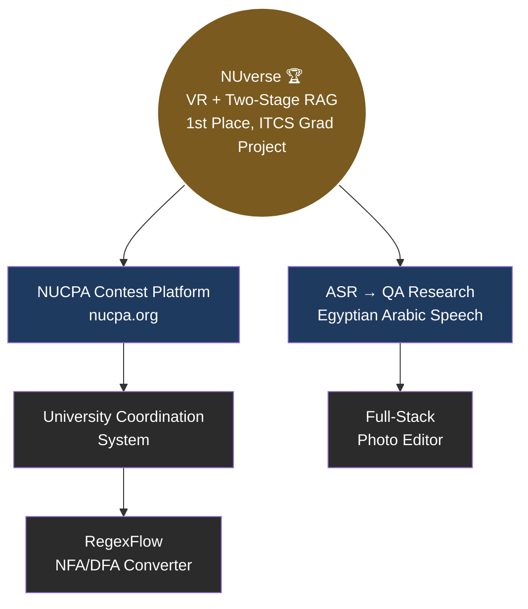
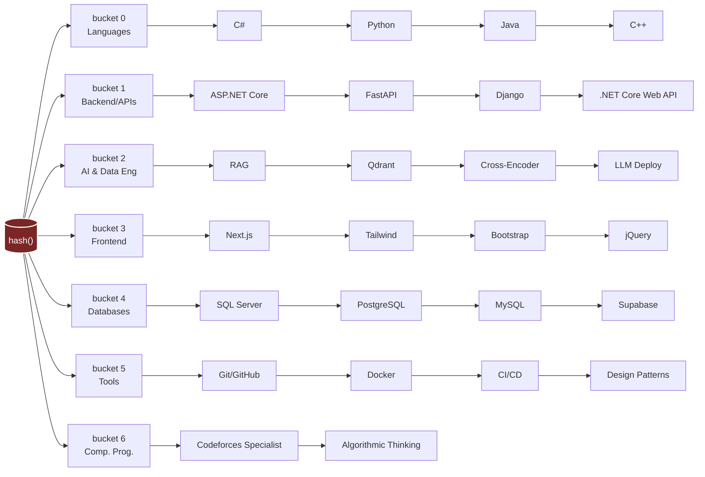
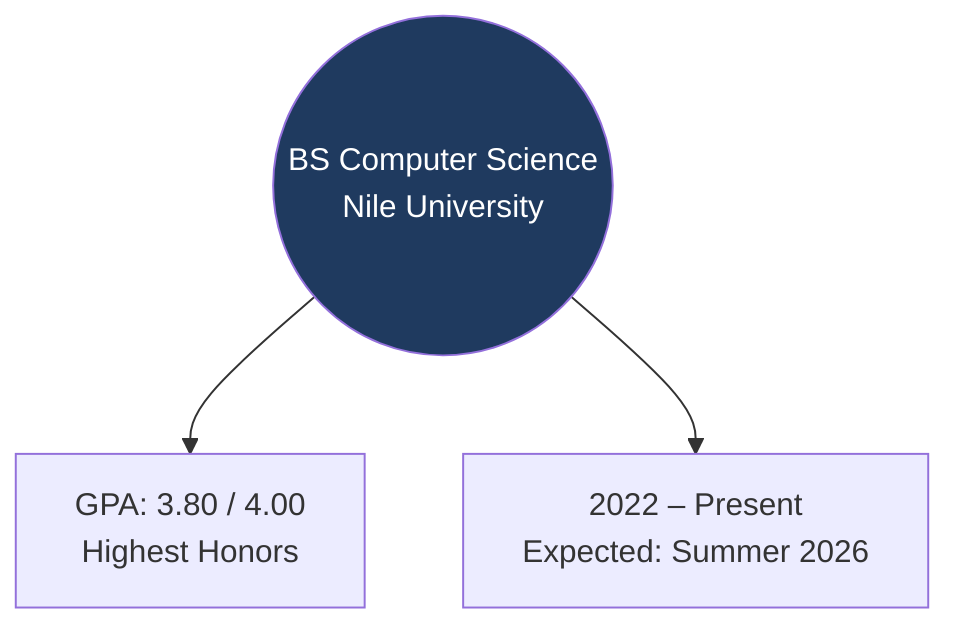
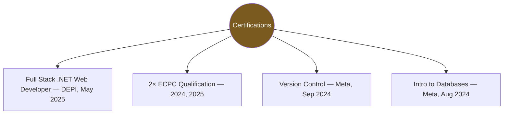

# Omar Elhossiny ⚡
**Backend Software Engineer** | CS Graduate, Nile University (3.80 GPA) | Codeforces Specialist

[](https://www.linkedin.com/in/omar-elhossiny)
[](https://codeforces.com/profile/HossHoss)
[](https://github.com/omar-28-2)
[](mailto:omarelhossiny85@gmail.com)

> 🚀 Actively seeking full-time Backend / Software Engineering roles.

---

## 🌲 Tech Stack 

```mermaid
graph TD
    classDef root fill:#ff3366,color:#fff,stroke:#fff,stroke-width:2px,font-weight:bold
    classDef lang fill:#ff9900,color:#fff,stroke:#fff
    classDef back fill:#00cc99,color:#fff,stroke:#fff
    classDef ai fill:#6666ff,color:#fff,stroke:#fff
    classDef db fill:#0099ff,color:#fff,stroke:#fff
    classDef tool fill:#666666,color:#fff,stroke:#fff

    Root((Tech Stack)):::root

    Root --> Lang(Languages):::lang
    Root --> Back(Backend & APIs):::back
    Root --> AI(AI & Data Engineering):::ai
    Root --> DB(Databases):::db
    Root --> Tools(Tools & Practice):::tool

    Lang --> L1[C#]:::lang
    Lang --> L2[Python]:::lang
    Lang --> L3[Java / C++]:::lang

    Back --> B1[ASP.NET Core]:::back
    Back --> B2[FastAPI]:::back
    Back --> B3[Django]:::back

    AI --> A1[RAG Pipelines]:::ai
    AI --> A2[Qdrant]:::ai
    AI --> A3[LLM Deploy]:::ai

    DB --> D1[SQL Server]:::db
    DB --> D2[PostgreSQL]:::db
    DB --> D3[Supabase]:::db

    Tools --> T1[Git / Docker]:::tool
    Tools --> T2[CI/CD]:::tool
    Tools --> T3[Clean Arch]:::tool

## 🔗 Career Path — Union-Find, visualized

Every role is a node. Over time, each one gets **union()'d** into the same connected component — one engineer, one growing tree of experience.

```mermaid
graph BT
    Omar((Omar<br/>root of the set))

    R1[Backend Dev Intern<br/>Raya Trade<br/>Aug–Sep 2024] --> R2
    R2[Junior TA<br/>Nile University<br/>Feb 2024–Feb 2025] --> R3
    R3[Full Stack .NET Trainee<br/>DEPI<br/>Oct 2024–May 2025] --> R4
    R4[Vice Head, SWE Course<br/>GDG Nile University<br/>Mar–Jun 2025] --> R5
    R5[Head of Technical<br/>NU Students' Union<br/>Jun 2025–Present] --> Omar

    style Omar fill:#7a2626,color:#fff,stroke:#fff,stroke-width:2px
    style R1 fill:#333,color:#fff
    style R2 fill:#333,color:#fff
    style R3 fill:#333,color:#fff
    style R4 fill:#333,color:#fff
    style R5 fill:#333,color:#fff
```

| Node | Interval | Path-compressed summary |
|---|---|---|
| **Head of Technical** — NU Students' Union | Jun 2025 – Present | Led an engineering team on campus-wide platforms & registration systems; owned full SDLC |
| **Vice Head, SWE Course** — GDG Nile University | Mar – Jun 2025 | Co-designed curriculum with NU IECC; mentored 60+ junior students |
| **Full Stack .NET Trainee** — DEPI | Oct 2024 – May 2025 | Built full-stack apps (C#, ASP.NET Core MVC, SQL Server) in Agile sprints |
| **Junior Teaching Assistant** — Nile University | Feb 2024 – Feb 2025 | Labs, grading, debugging mentorship: Python, Java, C++, Discrete Math |
| **Backend Dev Intern** — Raya Trade | Aug – Sep 2024 | Backend services (ASP.NET Core, C#) for "Spend Smart" ecosystem |

---

## 🌳 Projects — a Tree, ordered by system complexity



**`NUverse`** — Multi-modal platform bridging a Unity VR client and Next.js web portal via an async FastAPI backend. Zero-hallucination, Two-Stage RAG (Qdrant + cross-encoder re-ranking) for fact-grounded retrieval; voice-to-voice VR Professor; English/Arabic code-switching admissions chatbot.

**`NUCPA Contest Platform`** — Full-stack contest system: registrations, algorithmic validation, admin monitoring. Next.js + Django + Supabase/PostgreSQL, cleanly decoupled.

**`ASR → QA Pipeline`** — End-to-end Speech-to-Text → QA for Egyptian Arabic (NileTTS dataset). Fine-tuned Whisper-small: **0.1168 WER / 0.0389 CER**. Benchmarked AraT5 (generative) vs. AraELECTRA (extractive) downstream.

**`University Coordination System`** — ASP.NET Core MVC app managing the admission funnel, degree programs, and secure transactions on a relational SQL Server schema.

**`Full-Stack Photo Editor`** — Real-time matrix filters, live histograms, FFT noise removal. Next.js + Tailwind frontend, Python/Flask image backend.

**`RegexFlow`** — Regex → postfix → NFA table → minimized DFA, rendered as live transition graphs via Graphviz.

---

## 🗃️ Skills — Hash Table Style

Each skill is hashed into a bucket by category. Collisions are chained.

```
 index │ bucket key        │ chain (collisions)
───────┼────────────────────┼──────────────────────────────────────────
  0    │ Languages          │ → C# → Python → Java → C++
  1    │ Backend/APIs       │ → ASP.NET Core → FastAPI → Django → .NET Core Web API → REST APIs
  2    │ AI & Data Eng.     │ → RAG → Qdrant → Cross-Encoder Re-ranking → LLM Deployment
  3    │ Frontend           │ → Next.js → HTML5 → CSS3 → JavaScript → Tailwind → Bootstrap → jQuery
  4    │ Databases          │ → SQL Server → PostgreSQL → MySQL → Supabase
  5    │ Tools & Practices  │ → Git → GitHub → Docker → Unit Testing → System Design → Design Patterns
  6    │ Competitive Prog.  │ → Codeforces Specialist → Advanced Algorithmic Thinking
```



---

## 🗂️ Education



## 📜 Certifications — leaf nodes (no children)



---

## 📬 Connect — O(1) lookup

- 📧 omarelhossiny85@gmail.com
- 🌐 [LinkedIn](https://www.linkedin.com/in/omar-elhossiny)
- 💻 [Codeforces](https://codeforces.com/profile/HossHoss)
- 📁 [GitHub](https://github.com/omar-28-2)

## 🧠 Execution Philosophy

- 🧩 **Algorithmic Rigor** — architectural bottlenecks get treated like competitive programming constraints: strict time/space complexity analysis.
- 🚀 **Production-Ready** — robust, decoupled systems with clean logic, built to scale under real-world, high-concurrency load.
- 🌳 **Structure Over Chaos** — every system has a shape: a tree, a graph, a DAG — nothing is spaghetti by accident.
